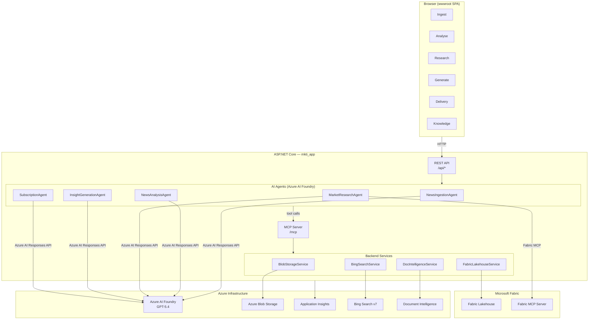
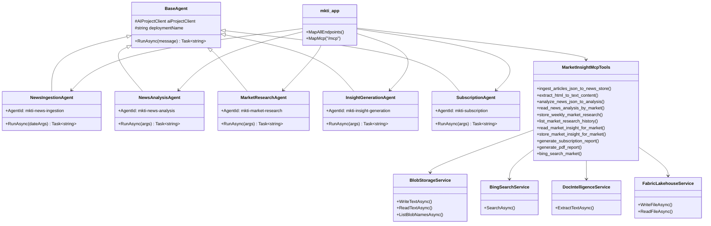
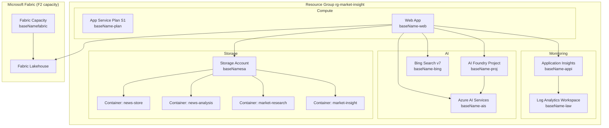
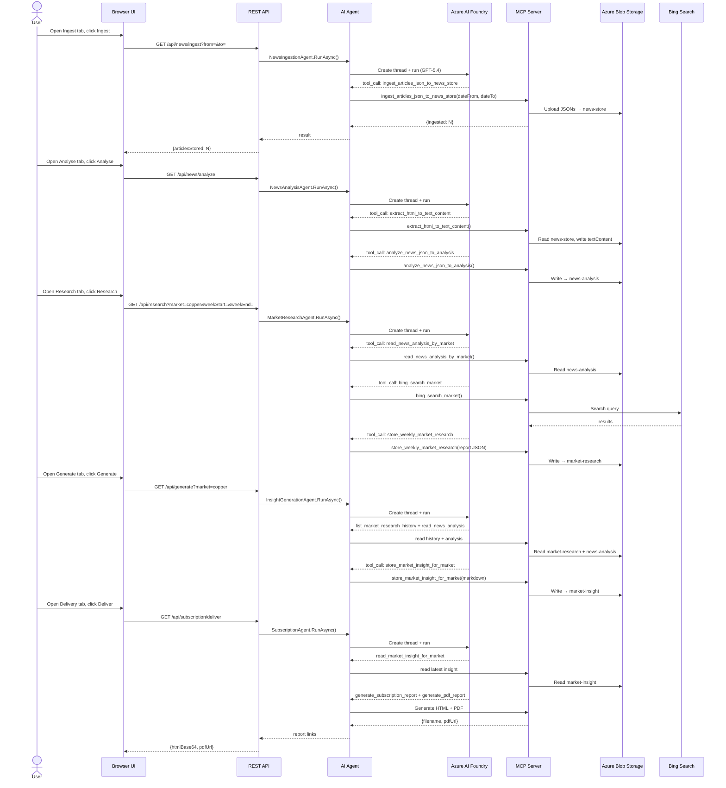

# Market Insight Agent — Solution Design

## Overview

Market Insight Agent (`mkti_app`) is an ASP.NET Core web application that orchestrates a pipeline of AI agents to ingest commodity news, analyse it, produce weekly research snapshots, generate professional market-insight reports, and deliver branded PDF subscriptions — all powered by Azure AI Foundry, Azure Blob Storage, Microsoft Fabric Lakehouse, and Bing Search.

---

## High-Level Architecture

---

## Agent Pipeline (Data Flow)

```mermaid
flowchart LR
    subgraph Source["Source Data"]
        Files["data/articles/\nyyyy-MM-dd_guid.json"]
        BingAPI["Bing Search API"]
    end

    subgraph Pipeline["Agent Pipeline"]
        direction TB
        N1["① NewsIngestionAgent\nIngest article JSON files"]
        N2["② NewsAnalysisAgent\nHTML→text + structured analysis"]
        N3["③ MarketResearchAgent\nWeekly research report"]
        N4["④ InsightGenerationAgent\nProfessional insight report\n(6-month history)"]
        N5["⑤ SubscriptionAgent\nBranded HTML + PDF delivery"]
    end

    subgraph Storage["Azure Blob Storage"]
        C1["news-store\n{ts}_{guid}.json"]
        C2["news-analysis\n{ts}_{guid}.json"]
        C3["market-research\n{market}_{week}.json"]
        C4["market-insight\n{market}_{date}.md"]
        C5["temp/ reports\n*.html  *.pdf"]
    end

    Files -->|ingest_articles_json_to_news_store| N1
    N1 --> C1
    C1 -->|extract_html_to_text_content\nanalyze_news_json_to_analysis| N2
    N2 --> C2
    C2 -->|read_news_analysis_by_market| N3
    BingAPI -->|bing_search_market| N3
    N3 --> C3
    C3 -->|list_market_research_history| N4
    C2 -->|read_news_analysis| N4
    N4 --> C4
    C4 -->|read_market_insight_for_market| N5
    N5 --> C5
```

---

## Component Detail

---

## Azure Infrastructure

---

## API Endpoints

| Method | Path | Agent / Handler | Description |
|--------|------|----------------|-------------|
| GET | `/api/news/ingest` | NewsIngestionAgent | Ingest article JSON files into news-store |
| GET | `/api/news/list` | BlobStorageService | List blobs in news-store |
| GET | `/api/articles/list` | File system | List local article JSON files |
| GET | `/api/news/analyze` | NewsAnalysisAgent | Analyse news-store articles into news-analysis |
| GET | `/api/news/analysis/list` | BlobStorageService | List blobs in news-analysis |
| GET | `/api/research` | MarketResearchAgent | Run weekly market research |
| GET | `/api/research/list` | BlobStorageService | List market-research blobs |
| GET | `/api/generate` | InsightGenerationAgent | Generate market insight report |
| GET | `/api/generate/list` | BlobStorageService | List market-insight blobs |
| GET | `/api/subscription/deliver` | SubscriptionAgent | Generate subscription HTML + PDF |
| GET | `/api/knowledge` | BlobStorageService | Knowledge base query |
| GET | `/health` | ASP.NET Health Checks | Health probe |
| ANY | `/mcp` | MCP Server | Model Context Protocol endpoint |

---

## Sequence: End-to-End Pipeline

